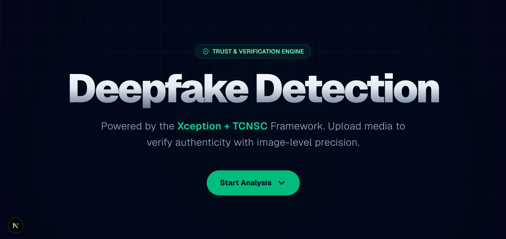
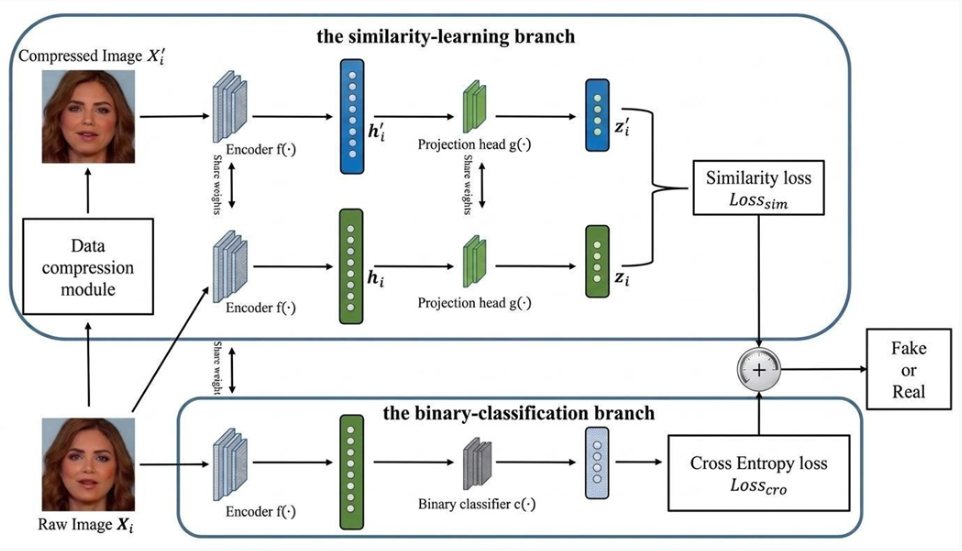
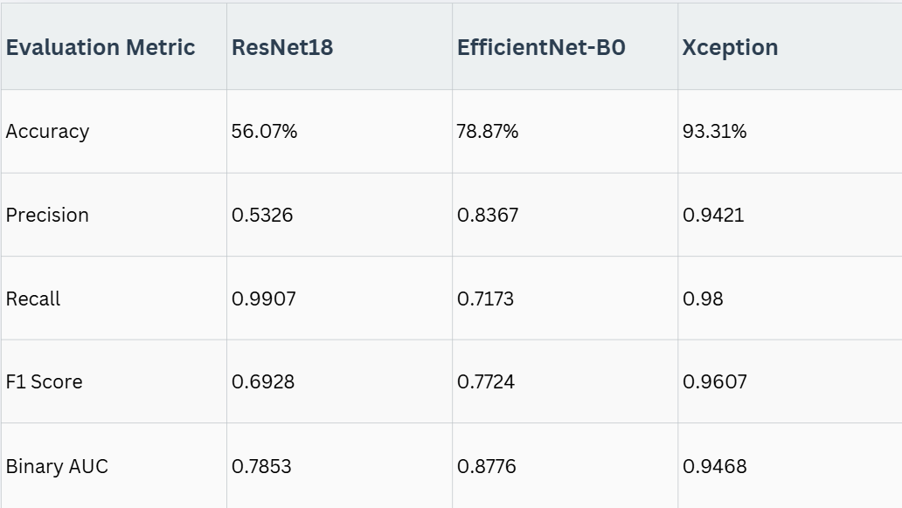
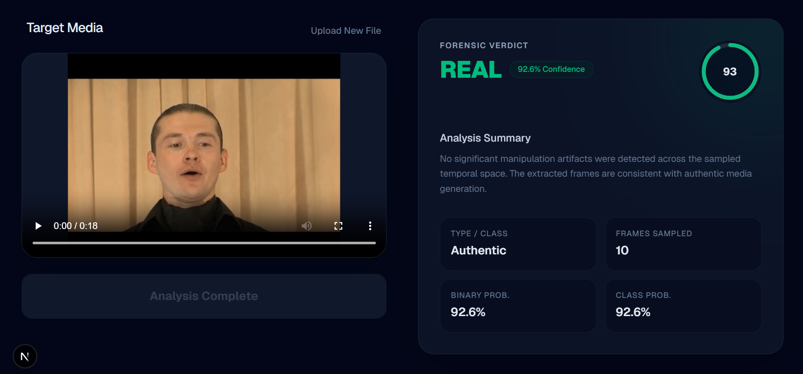
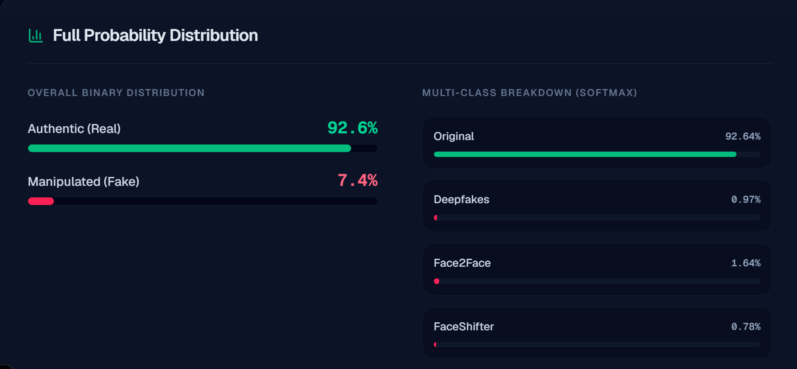

# DeepFake Video Forensics System

<p align="center">
  
</p>

A full-stack deepfake detection application that combines a research-paper-based compression-robust learning strategy with a modern web interface. The project uses an Xception-based TCNSC architecture, a custom FaceForensics++ derived dataset, and a FastAPI + Next.js deployment pipeline.

---

## Project Overview

Deepfake technology has made it possible to generate highly realistic synthetic videos, which creates serious challenges for media verification, digital trust, and cybersecurity. This project addresses that problem by building an end-to-end deepfake detection system that can analyze uploaded videos, detect facial manipulation, and report the most likely manipulation type.

The system is built around a two-branch learning strategy. One branch focuses on classification, while the other learns similarity between high-quality and compressed face images. This allows the model to remain more stable when videos are compressed during sharing or uploading.

The final implementation goes beyond a simple binary classifier. It uses multi-class training across six manipulation categories and binary inference during deployment. This means the system can identify both whether a video is real or fake and which manipulation type was detected if the video is fake.

---

## Business Case

Deepfake misuse is growing quickly across social media, journalism, fraud detection, and identity verification. Manual inspection alone is no longer reliable enough, especially when manipulated content is shared in compressed formats on mobile and social platforms.

This project demonstrates a working approach that can be used as a prototype for:

- content moderation
- fact-checking
- identity verification
- digital forensics
- media authenticity analysis

From a product perspective, the system is designed to be deployable. The backend can run locally or on a cloud machine, and the frontend provides a simple browser-based interface for uploading videos and viewing results.

---

## Motivation

This project was built with two goals in mind.

First, we wanted to implement a real research-paper-based deepfake detection system rather than a toy classifier. The TCNSC paper provided a strong foundation because it focuses on learning features that remain stable under compression.

Second, we wanted to create a working application that can be shown in a live demo and later extended into a deployable product. That is why the project includes a full training pipeline, a reusable inference backend, and a modern frontend user interface.

---

## Research Paper Implementation

The project implements the core idea of **Two-Branch Convolutional Networks with Similarity and Classifier (TCNSC)**.

The architecture contains two learning objectives:

1. **Classification branch**  
   Learns to classify a face image into one of the manipulation categories.

2. **Similarity branch**  
   Learns to keep feature embeddings of a high-quality image and its compressed version close to each other.

This helps the model focus on manipulation artifacts instead of compression noise.

The original idea was extended into a practical system by using:

- **Xception** as the final backbone
- **multi-class training** across six classes
- **binary inference** for real-world deployment
- **video-level prediction aggregation** in the application

<p align="center">
  
</p>

The figure above summarizes the training and inference flow. During training, a raw face image and a compressed version of the same face are processed together so the model learns compression-invariant features. During inference, the backend samples frames from the uploaded video, extracts faces, predicts frame-level labels, and aggregates them into a final decision.

---

## Key Features

- Video upload through a web interface
- Frame extraction from uploaded videos
- Face detection and cropping using MTCNN
- Compression-aware TCNSC training
- Multi-class manipulation classification
- Binary real/fake inference for the UI
- Fake-type identification for manipulated videos
- Confidence scores and probability breakdowns
- FastAPI backend with reusable inference modules
- Next.js frontend with a modern dashboard-style UI

---

## Technology Stack

### Machine Learning
- Python
- PyTorch
- torchvision
- timm
- scikit-learn
- NumPy

### Computer Vision
- OpenCV
- PIL
- MTCNN / facenet-pytorch

### Backend
- FastAPI
- Uvicorn

### Frontend
- Next.js
- React
- Tailwind CSS

### Training Environment
- Kaggle Notebook
- NVIDIA T4 GPU

---

## Dataset

The project uses a custom FaceForensics++ derived dataset prepared specifically for this system:

[FaceForensics++ Face Cropped Dataset](https://www.kaggle.com/datasets/mutafakram/faceforensics-face-cropped-dataset)

### Why a custom dataset was created

The original FaceForensics++ dataset is very large. The full dataset is around 2 TB, and even the C23 subset is much larger than what was practical for our training environment. Because of limited compute and storage, we created a smaller curated dataset that still preserves the important manipulation categories.

### Custom dataset summary

| Category | Images |
|---|---:|
| Original | 5000 |
| Deepfakes | 5000 |
| Face2Face | 5000 |
| FaceShifter | 5000 |
| FaceSwap | 5000 |
| NeuralTextures | 5000 |

**Total images:** 30,000

### Preprocessing details

- Face detection: MTCNN
- Crop margin: 90 pixels
- Final image size: 299 × 299
- Color format: RGB
- Training compression simulation: JPEG quality range 10–40

This preprocessing was designed to keep the facial region visible while including enough surrounding context for manipulation artifacts.

---

## Model Architecture

The final trained model uses:

- **Xception** as the shared feature extractor
- **Classification branch** for manipulation prediction
- **Similarity branch** for compression-invariant representation learning

### Training objective

The model is trained to minimize a combined objective:

- classification loss
- binary loss
- similarity loss

This improves both manipulation detection and real-world robustness under compression.

---

## Results

The final Xception-based model performed best among the tested backbones.

<p align="center">
  
</p>

| Model | Training Strategy | Accuracy | Precision | Recall | F1 Score | Binary AUC | Multi-Class Accuracy | Multi-Class AUC |
|---|---|---:|---:|---:|---:|---:|---:|---:|
| ResNet18 + TCNSC | Binary | 56.07% | 0.5326 | 0.9907 | 0.6928 | 0.7853 | — | — |
| EfficientNet-B0 + TCNSC | Binary | 78.87% | 0.8367 | 0.7173 | 0.7724 | 0.8776 | — | — |
| Xception + TCNSC + Multi-Class | Multi-Class + Binary Inference | 93.31% | 0.9421 | 0.9800 | 0.9607 | 0.9468 | 87.42% | 0.9848 |

### Interpretation

- ResNet18 served as the baseline.
- EfficientNet-B0 improved performance significantly.
- Xception produced the best overall results and was selected as the final model.

---

## User Interface

The application also includes a clean basic and advanced analysis views.

<p align="center">
  
</p>

<p align="center">
  
</p>

---

## System Workflow

### Training pipeline

1. Raw videos are processed into frames.
2. Faces are detected and cropped with MTCNN.
3. High-quality images are paired with compressed versions.
4. The model is trained with classification + similarity objectives.
5. The best checkpoint and metadata are saved for deployment.

### Inference pipeline

1. A user uploads a video.
2. Frames are sampled from the video.
3. Faces are detected and preprocessed.
4. The model predicts frame-level labels.
5. Predictions are aggregated into a final decision.
6. The UI displays:
   - Real / Fake result
   - Manipulation type
   - Confidence score
   - Probability breakdown

---

## Installation and Setup

### Prerequisites

Before running the project, make sure the following are installed:

- Python 3.10 or later
- Node.js 18 or later
- Git
- A virtual environment tool such as `venv`
- Enough disk space for the model artifacts

### Clone the repository

```bash
git clone https://github.com/your-username/deepfake-detection-system.git
cd deepfake-detection-system
```

---

## How to Run

### 1) Backend setup

Go to the backend folder and create a virtual environment.

#### Windows PowerShell

```powershell
cd backend
python -m venv .venv
.\.venv\Scripts\activate
```

#### macOS / Linux

```bash
cd backend
python3 -m venv .venv
source .venv/bin/activate
```

Install backend dependencies:

```bash
pip install --upgrade pip
pip install -r requirements.txt
```

If a requirements file is not present yet, install the core dependencies manually:

```bash
pip install fastapi uvicorn timm torch torchvision opencv-python pillow facenet-pytorch numpy scikit-learn
```

### 2) Add the trained model artifacts

Place the following files inside:

```text
backend/artifacts/
```

Required files:

- `best_tcnsc_model_state_dict.pth`
- `best_tcnsc_model_meta.json`
- `best_tcnsc_model_config.json`
- `class_mapping.json`

These files are generated after Kaggle training and are required for inference.

### 3) Start the backend

From the `backend` directory:

```bash
uvicorn app.main:app --reload
```

If your `main.py` is directly inside `backend/`, use:

```bash
uvicorn main:app --reload
```

The backend should become available at:

```text
http://127.0.0.1:8000
```

Swagger docs:

```text
http://127.0.0.1:8000/docs
```

### 4) Frontend setup

Open a second terminal and go to the frontend folder.

```bash
cd frontend
npm install
npm run dev
```

The frontend should run at:

```text
http://localhost:3000
```

### 5) Use the application

1. Open the frontend in your browser.
2. Upload a video.
3. Wait for frame extraction and prediction.
4. Read the final verdict:
   - Real
   - Fake
   - Fake type if applicable

---

## Project Structure

```text
deepfake-detection-system/
├── backend/
│   ├── app/
│   │   ├── main.py
│   │   ├── inference.py
│   │   ├── model_utils.py
│   │   └── video_utils.py
│   ├── artifacts/
│   │   ├── best_tcnsc_model_state_dict.pth
│   │   ├── best_tcnsc_model_meta.json
│   │   ├── best_tcnsc_model_config.json
│   │   └── class_mapping.json
│   └── requirements.txt
├── frontend/
│   ├── src/
│   └── package.json
├── screenshots/
│   ├── 1.HeroSection.png
│   ├── 2.UploadPage.png
│   ├── 3.BasicAnalysis.png
│   ├── 4.AdvanceAnalysis.png
│   ├── 5.Architecture.png
│   └── 6.ModelEvaluation.png
└── README.md
```

---

## Challenges Encountered

### Dataset size and compute limitations

The original FaceForensics++ dataset was far too large for the available hardware. Training directly on the full dataset would have required much more storage and compute than was available in the project timeline.

### Compression artifacts

Compressed videos can introduce artifacts that are easy for a model to confuse with manipulation traces. The TCNSC similarity branch was added to reduce this problem.

### Frame-level constraints

Because training was performed on frames rather than full videos, it was necessary to build a careful splitting strategy to avoid leakage between training, validation, and test sets.

### Long training time

The final model required several hours of training on Kaggle GPUs. This made careful checkpointing, artifact saving, and validation very important.

---

## Future Improvements

The current system is already a complete end-to-end deepfake detection application, but there are several strong directions for future work.

### Video-level temporal analysis

The current system primarily analyzes sampled frames. A future version could model temporal consistency across entire sequences using:

- 3D CNNs
- LSTMs / GRUs
- Temporal Transformers
- Video Swin Transformer

This would help detect inconsistencies that only appear over time.

### Audio + lip-sync analysis

A strong next step is multimodal detection. Deepfake videos often have visual manipulation but may also contain audio mismatches. Comparing spoken audio with lip movement can help detect manipulation that a frame-based model might miss.

### More robust inference on real-world videos

Future versions can use:

- better frame sampling
- confidence-weighted video aggregation
- hard negative mining
- more diverse social-media-style training data

### Explainable AI

Heatmaps such as Grad-CAM can be added to show which regions influenced the prediction. This would increase interpretability and trust.

### Larger and more diverse datasets

Future training could include additional datasets such as:

- CelebDF
- DFDC
- other manipulation benchmarks

---

## Conclusion

This project demonstrates an end-to-end deepfake detection system built from research to deployment. It combines a compression-robust TCNSC-style learning strategy, a custom curated dataset, a strong Xception backbone, and a practical web interface for real video analysis. The result is a fully usable application that is suitable for demos, portfolio presentation, and future research extension.

---

## Acknowledgements

This project was developed as part of the Artificial Intelligence Lab / final project work at UET Lahore.
